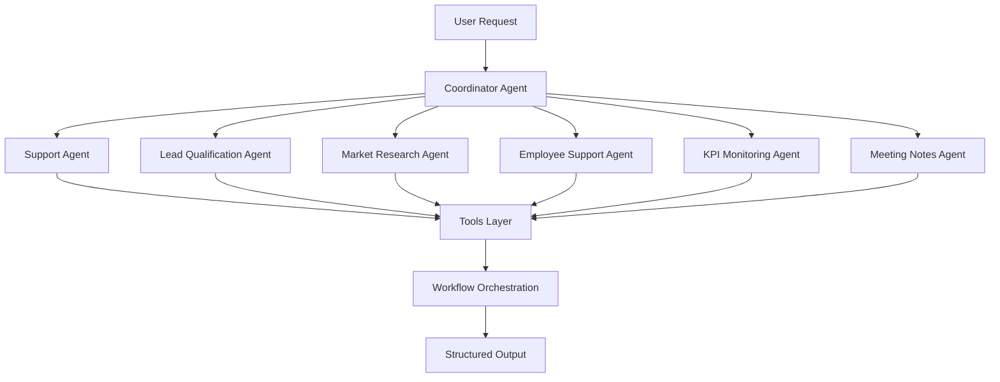

# Greenscale No-Code AI Agent Repository

A modular no-code AI agent framework that enables organizations to build,
orchestrate, and deploy multi-agent workflows without extensive software
development.

## Problem

Many companies want to automate support, lead qualification, research,
documentation, and internal operations using AI, but building custom AI
systems requires engineering resources, infrastructure, and maintenance.

## Solution

This repository demonstrates a reusable no-code AI agent architecture
that combines:

- Agent personas
- Workflow orchestration
- Tool integrations
- Structured outputs
- Human-in-the-loop review
- Monitoring and testing

to rapidly deploy AI-powered business workflows.



## Repository Scope

This repository is a redacted demonstration of a proprietary no code AI agent. It is intended to showcase project structure, engineering practices, testing, CI/CD, and workflows while protecting confidential intellectual property.

### Included

- Public-facing project architecture
- Agent personas and instructions
- Example workflow routing logic
- Example tool schemas
- Sample retrieval/context files
- CI validation and basic testing structure

### Excluded

- Proprietary datasets and annotations
- Production-trained model weights
- Internal research code
- Customer-specific workflows
- Deployment infrastructure
- Confidential performance benchmarks


The included code is representative of the overall system design but does not contain all components used in production environments.

## Example Use Cases

- Route customer-support requests to sales or finance workflows
- Reconcile invoices against expense policies
- Use retrieval context to answer employee or product-support questions
- Optimize Greenscale specific data pipelines and workflows

## Repo Structure

```text
├── .github/workflows/        # CI validation
├── agents/                   # Agent personas and instructions
├── code_modules/             # Python modules used by agents
├── knowledge/                # Retrieval/context files
├── workflows/                # Multi-agent routing logic
├── .env.example              # Environment variable template
├── AGENTS.md                 # Agent interaction guide
└── README.md
````
